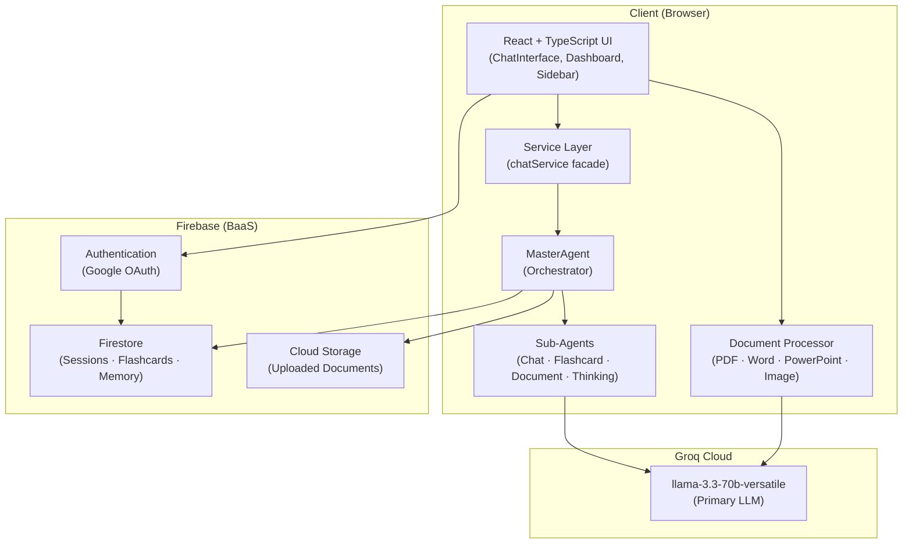
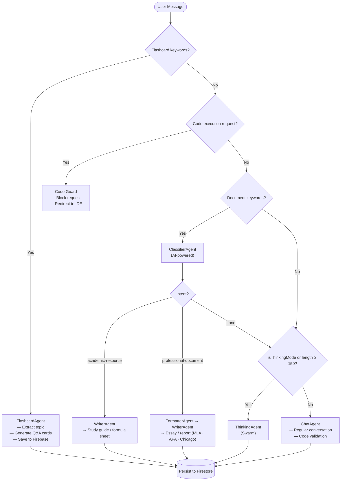
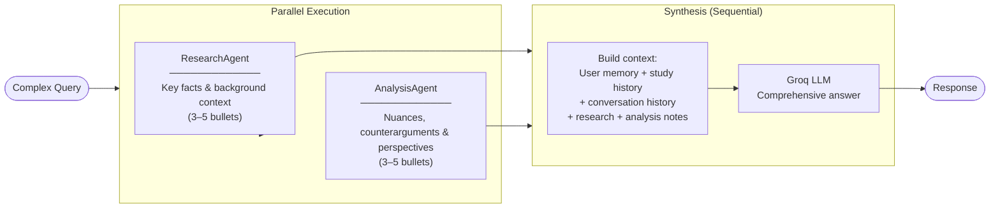
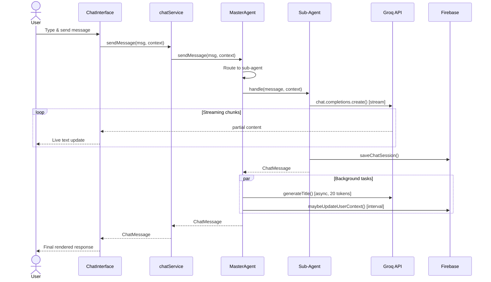
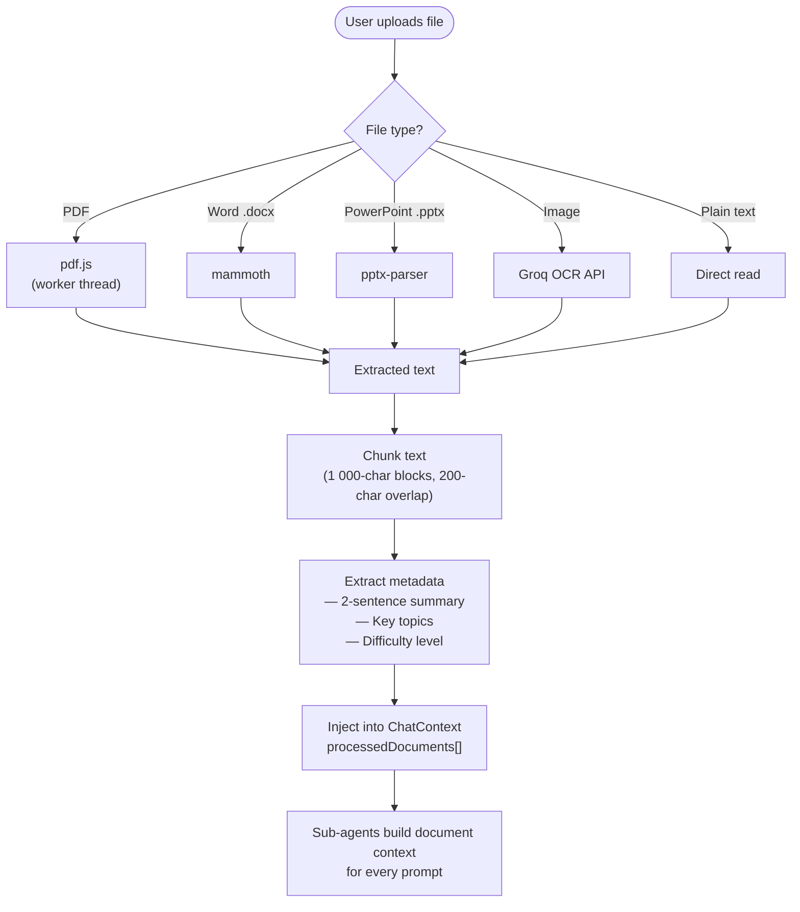
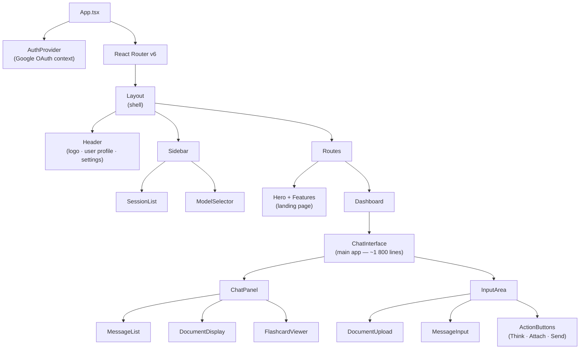
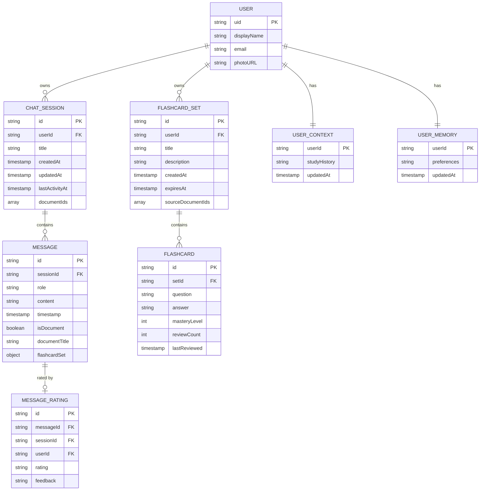

# Newton AI — High-Level Architecture Diagrams

---

## 1. System Architecture

High-level view of the tech stack and external service integrations.

---

## 2. Multi-Agent Routing Flow

How MasterAgent routes each incoming message to the correct sub-agent.

---

## 3. ThinkingAgent — Parallel Swarm

How ThinkingAgent handles complex queries using parallel sub-agents.

---

## 4. Message Lifecycle — Sequence Diagram

End-to-end flow from user input to final streamed response.

---

## 5. Document Processing Pipeline

How uploaded files are processed and injected into agent context.

---

## 6. React Component Hierarchy

High-level component tree and how state flows through the UI.

---

## 7. Firebase Data Model

Collections stored in Firestore and their relationships.

