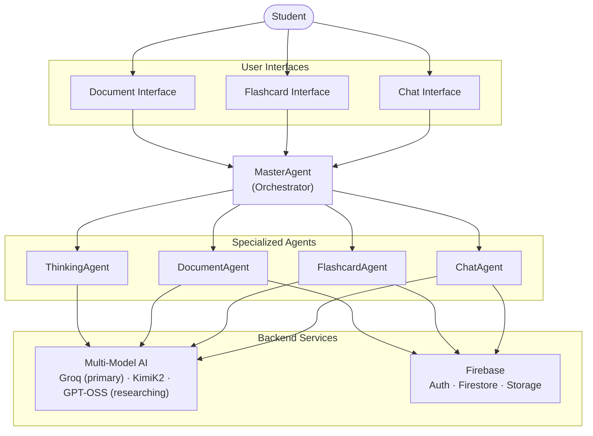
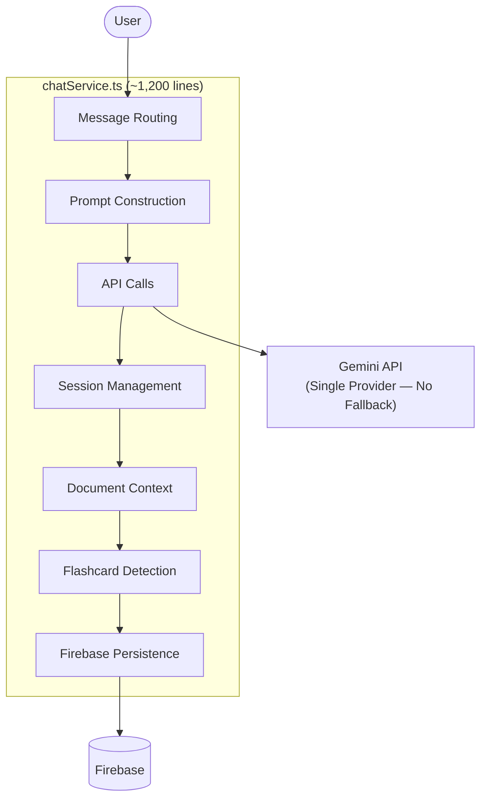
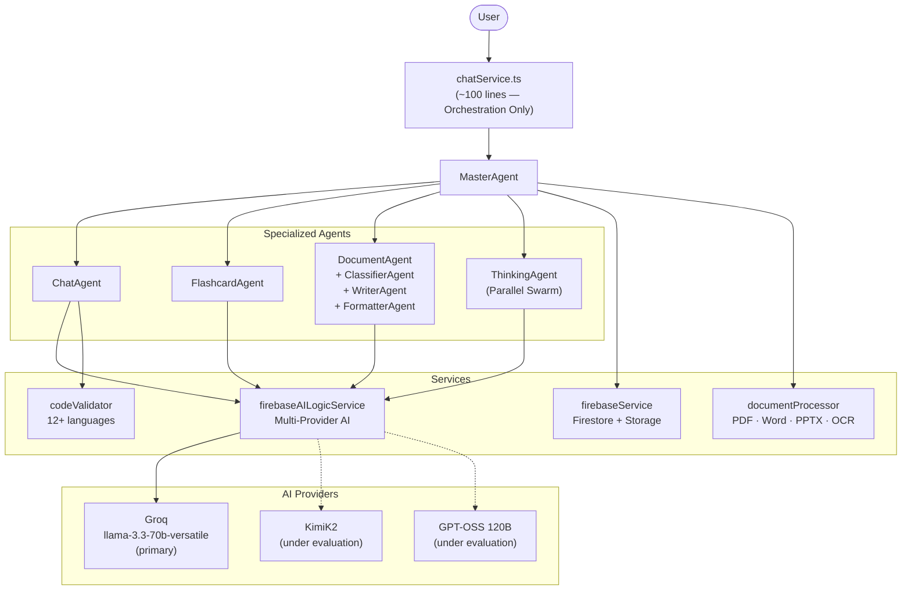
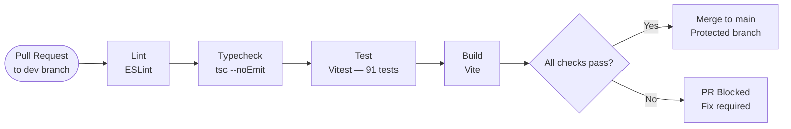
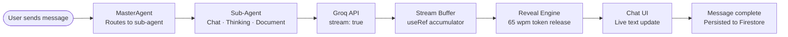
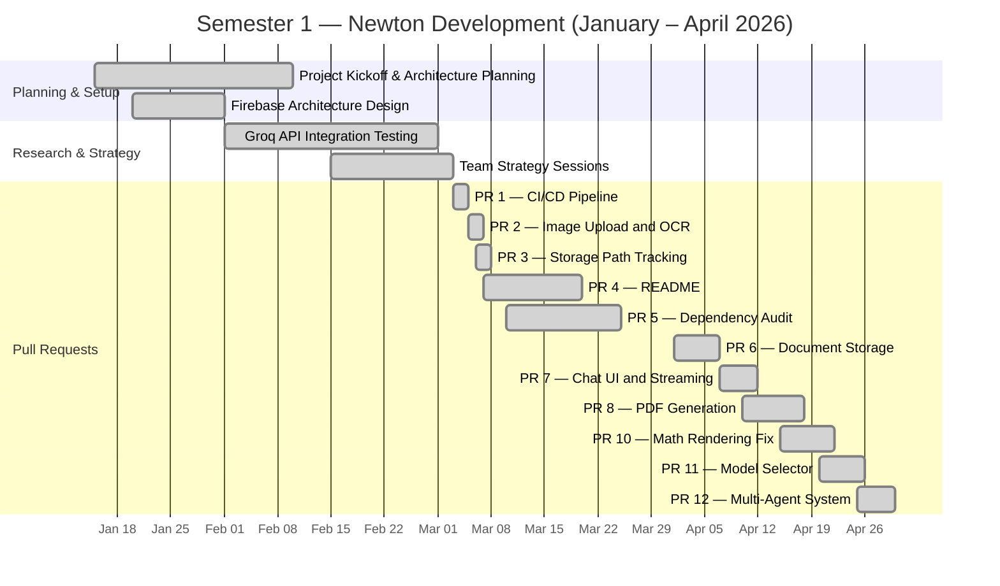
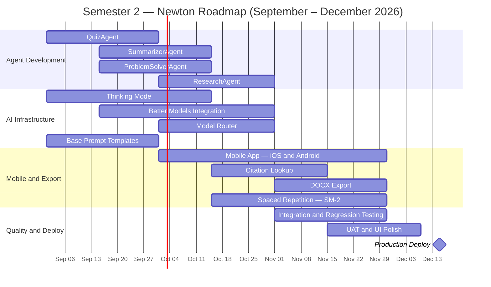
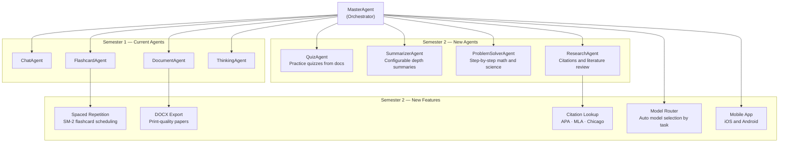

# Newton AI — Report Figures
*Semester 1 Halfway Check-In — May 2026*

---

## Figure 1: Newton Project Overview

*Section 1 — Introduction. Students interact through Chat, Flashcard, and Document interfaces, coordinated by MasterAgent.*

---

## Figure 2: Inherited Monolithic Architecture

*Section 4.1 — From Monolith to Service Layer. All logic lived in a single ~1,200-line chatService.ts file.*

---

## Figure 3: Current Multi-Agent Architecture

*Section 4.1 — After decomposition. chatService is now ~100 lines; MasterAgent coordinates all specialized agents.*

---

## Figure 4: CI/CD Pipeline

*Section 5 — Pull Request History (PR #1). Every pull request runs lint, typecheck, test, and build before the merge gate.*

---

## Figure 5: Chat UI Streaming Pipeline

*Section 5 — Pull Request History (PR #7). Messages flow from the UI through Groq's streaming API, buffer in a ref, and reveal at 65 wpm.*

---

## Figure 6: Semester 1 Development Timeline

*Section 6.1 — January through April 2026. Planning through PR #12 Multi-Agent System.*

---

## Figure 7: Semester 2 Development Roadmap

*Section 6.2 — September through December 2026. Agent expansion, AI infrastructure, mobile app, and production deploy.*

---

## Figure 8: Semester 2 Agent Expansion

*Section 6.2 / Section 8 — MasterAgent will coordinate new agents (Quiz, Summarizer, ProblemSolver, Research) alongside new platform features.*

