# Newton AI — System Diagrams
*Technical reference for capstone report — May 2026*

---

## DFD Level 0 — Context Diagram

*Newton as a single process. Shows every external entity and the data flowing in and out.*

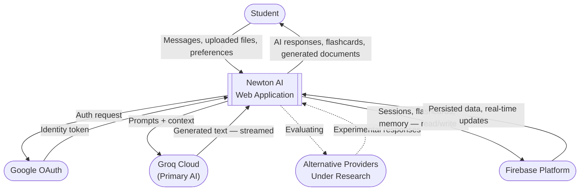

---

## DFD Level 1 — Main Processes

*Newton broken into its six primary processes with internal data stores.*

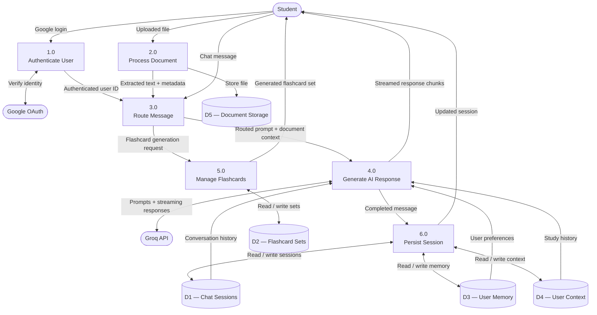

---

## ERD — Complete Data Model

*All Firestore collections, fields, and relationships.*

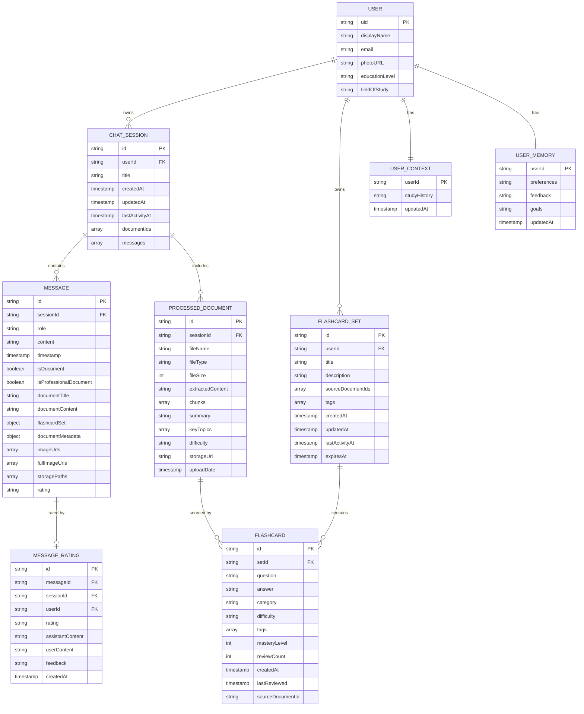

---

## Class Diagram — Agent Hierarchy

*All agent classes, their responsibilities, and how they compose.*

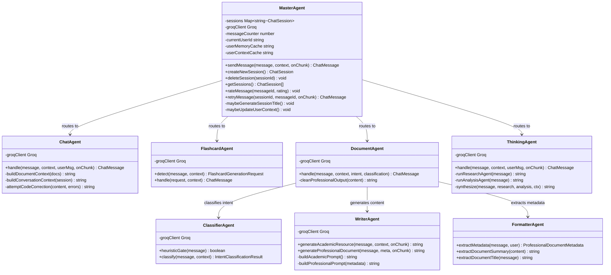

---

## State Diagram — Chat Session Lifecycle

*A session moves from empty to active, gets titled, syncs to Firestore, and can be deleted.*

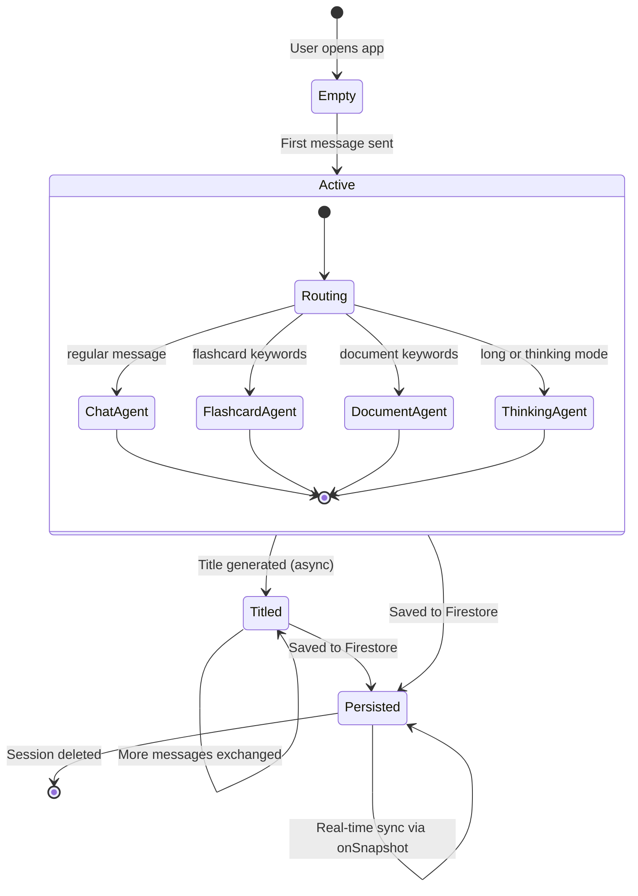

---

## State Diagram — Flashcard Mastery Progression

*Each flashcard moves through four mastery levels. Tracks SM-2-style spaced repetition.*

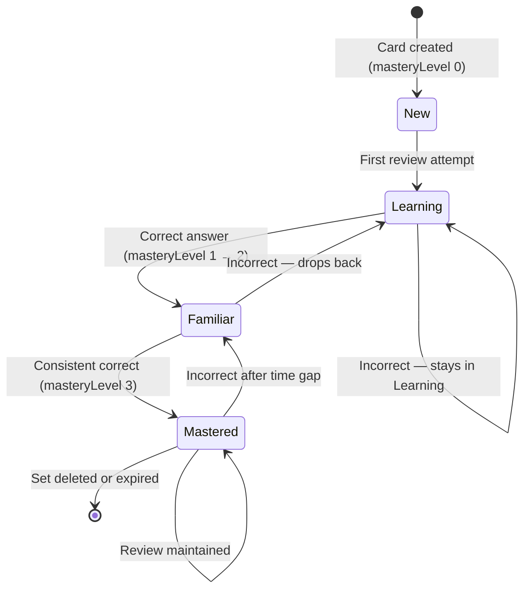

---

## Sequence — Authentication and Session Load

*Google Sign-In through Firebase Auth, followed by loading the user's sessions and memory.*

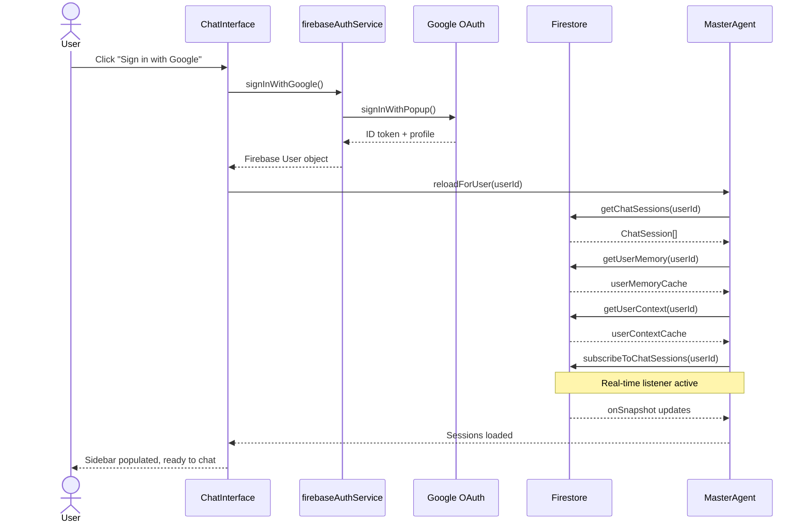

---

## Sequence — Document Upload and OCR

*A file goes from the user's device to extracted text inside the AI's context.*

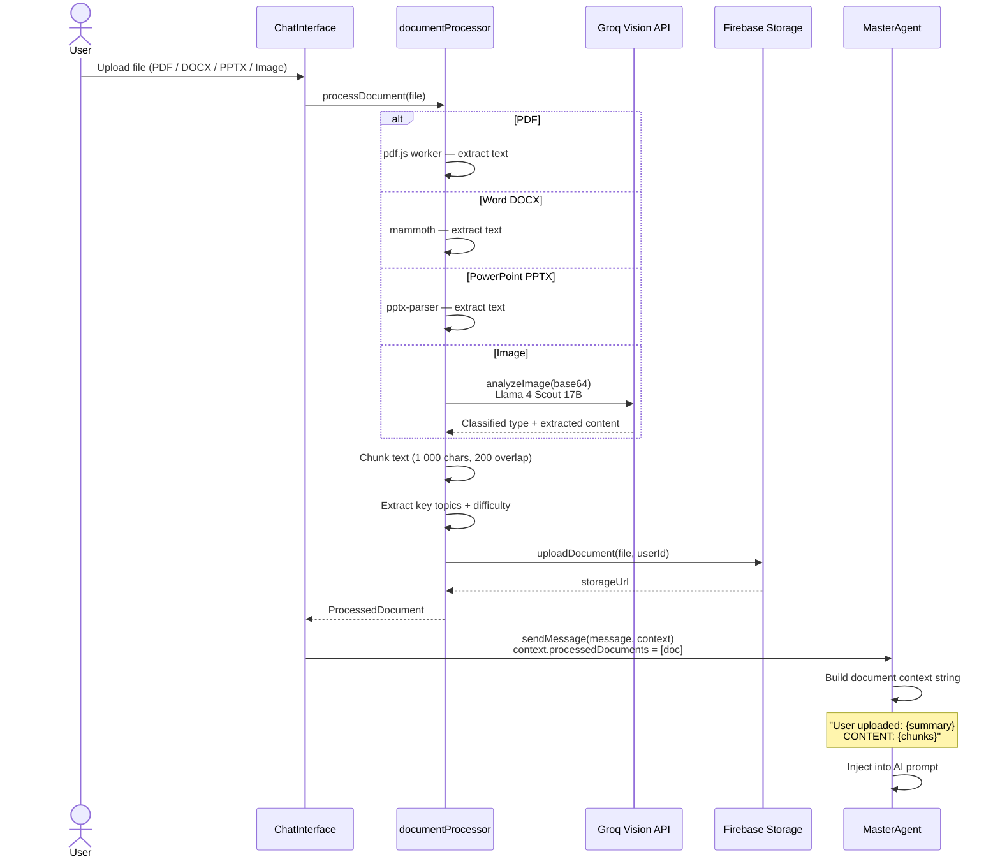

---

## Deployment Architecture

*How Newton is built, hosted, and connected to external services.*

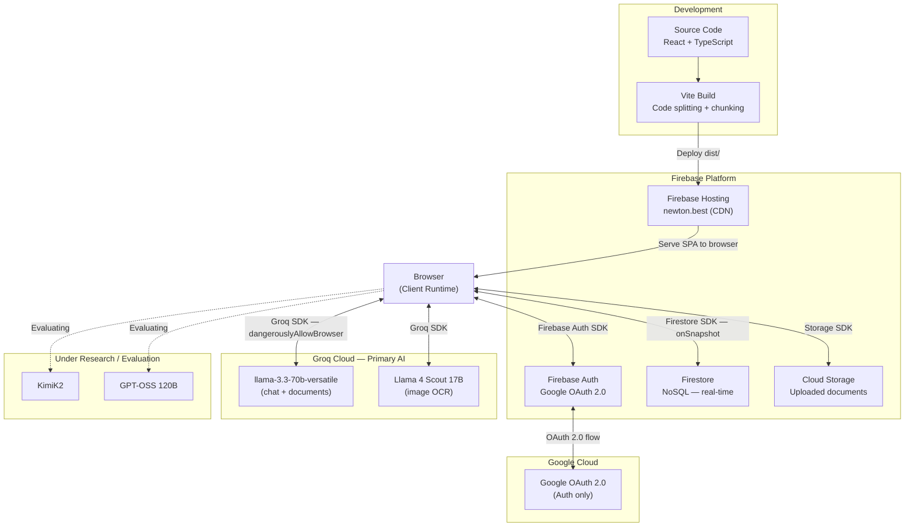

---

## Flowchart — AI Provider Strategy

*Groq is the primary provider. Alternative providers are under active research and evaluation.*

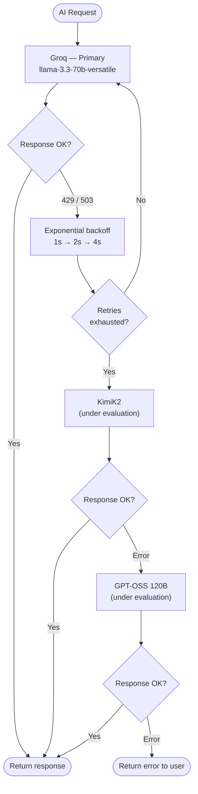

---

## Flowchart — Groq Model Selection

*Newton uses different Groq models depending on the task type.*

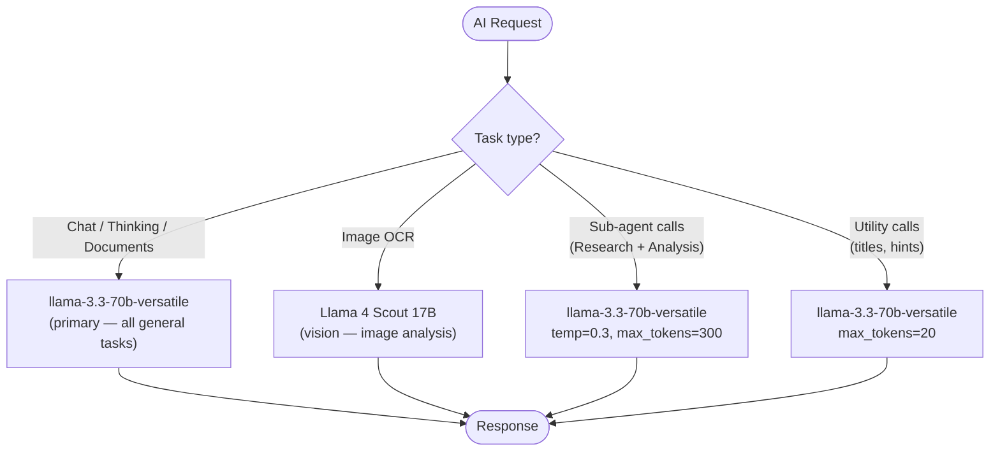

---

## Flowchart — Code Validation and Auto-Correction

*Every AI response with code is silently validated. Errors are sent back for automatic correction.*

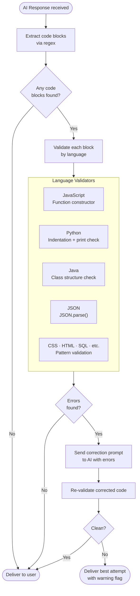
